# Technical Test Report: Car Price Prediction Model

This report provides a summary of the assignment. For more detailed information on data processing and other aspects, please refer to the notebook located at `notebooks/research.ipynb`.

## 1. Data Preprocessing

### Elimination of Brands Not Representing 90% of Total Cars
- I filtered out car brands that do not account for at least 90% of the total cars in the dataset to focus on the most common brands.

### Handling Missing Values
- **Version 1**: I dropped rows with missing values (`NaN`).
- **Version 2**: I used `SimpleImputer` to impute missing values in categorical and numerical features, followed by dropping any rows with remaining missing values.
- **Version 3**: I applied probabilistic imputation to handle missing values while maintaining the distribution of the data, followed by dropping rows with remaining missing values.

### Skewness Handling
- I applied a **log transformation** to the price column to handle the skewness and make the distribution more normal.

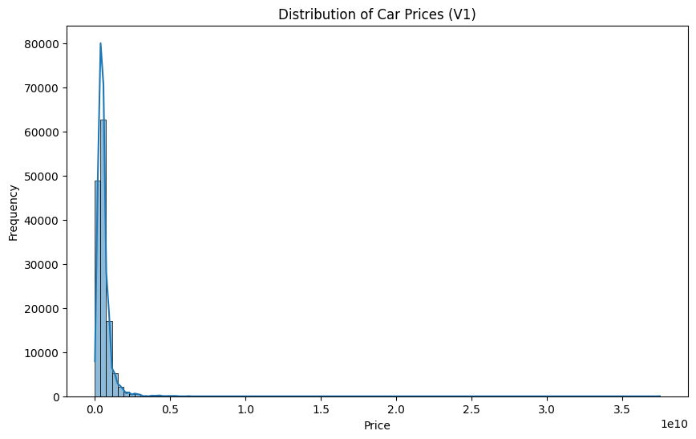 
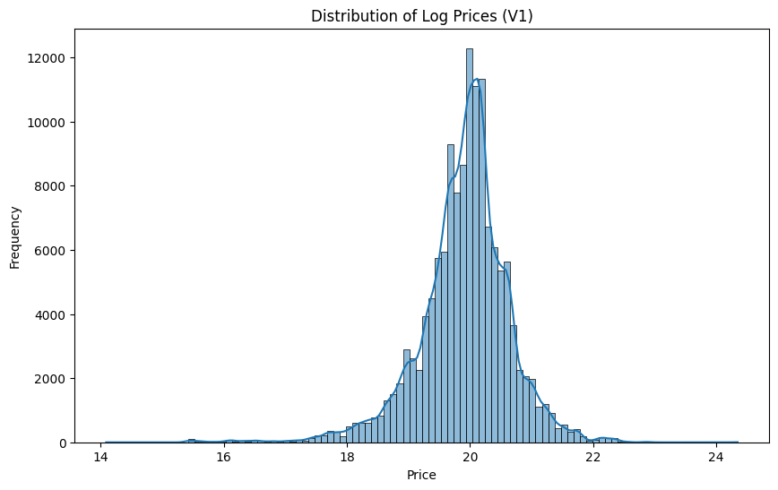

### Filtering Used Cars
- I excluded cars that were marked as new to focus the model on predicting prices of used cars only.

## 2. Data Analysis

### Mileage and Price
- I observed a negative correlation between mileage and price through a scatter plot. It showed that cars with lower mileage tend to have higher prices, while cars with high mileage have a lower maximum price.

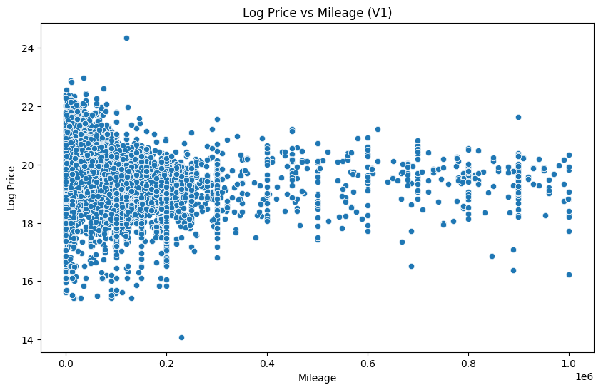
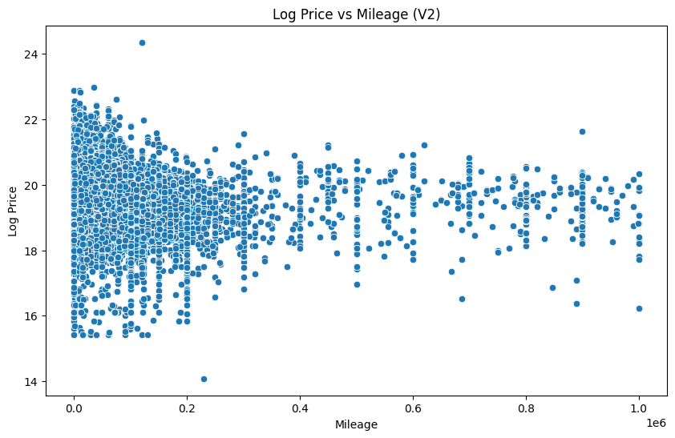
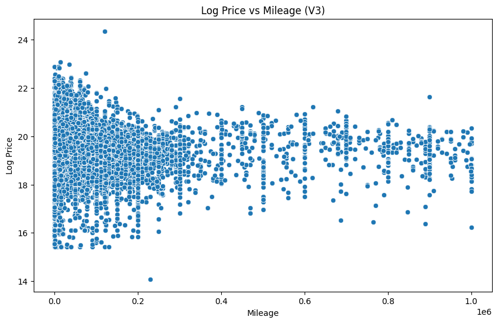

### Fuel Type and Price
- A boxplot analysis revealed that petrol cars tend to be the cheapest, with the median and distribution lower than other fuel types. Electric cars follow, with the upper quartile slightly smaller than that of oil cars. Hybrid cars were found to have the highest median price, as well as the largest interquartile range.

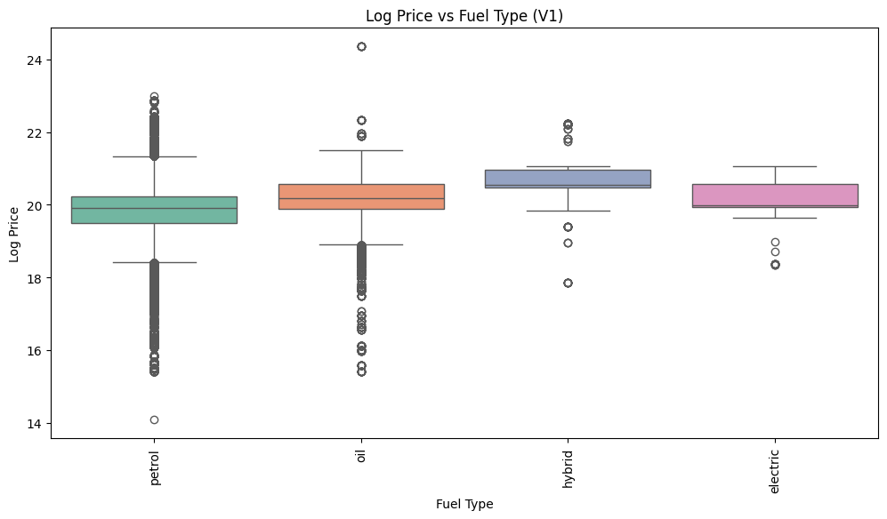 
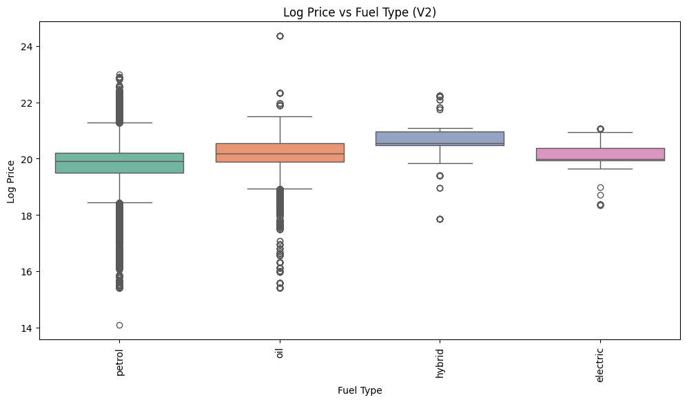
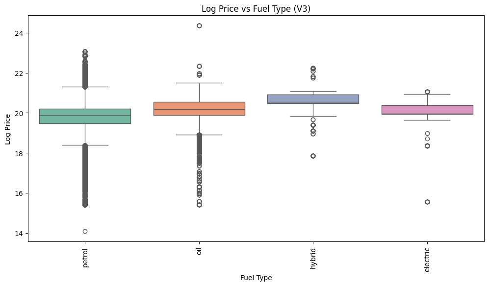

### Comparing Cars Within the Same Price Segment
- To compare two cars in the same price segment, follow these steps:
  1. **Segment Cars by Price**: Group cars into categories such as under 300M, 300M-500M, etc.
  2. **Select Two Cars**: Randomly choose two cars from the same segment.
  3. **Compare Key Features**: Evaluate important specifications like brand, model, price, fuel type, mileage, and seating capacity.

This streamlined approach simplifies the decision-making process, allowing buyers to easily compare vehicles within a similar price range and make informed choices based on relevant features.

**Comparison of two random cars from the '300M-500M' segment**:
|Feature|Toyota Camry|Hyundai Elantra|
|---|---|---|
|Manufacture Date|2013|2017|
|Brand|Toyota|Hyundai|
|Model|Camry|Elantra|
|Origin|Việt Nam|Việt Nam|
|Type|Sedan|Sedan|
|Seats|5|5|
|Gearbox|AT|AT|
|Fuel|petrol|petrol|
|Color|black|white|
|Mileage V2|80000|53000|
|Price|499000000|440000000|
|Condition|used|used|
|Log Price|20\.0281166557198|19\.902285287149308|
|Price Segment|300M-500M|300M-500M|

## 3. Model Development and Evaluation

### XGBoost Model
- I used **XGBoost** with two versions of the model: one trained with the **MAE** (Mean Absolute Error) loss function and the other with the **MSE** (Mean Squared Error) loss function.

### Performance Metrics
- I decided to focus on **SMAPE** (Symmetric Mean Absolute Percentage Error) and **MAE** to evaluate the performance of the models, as SMAPE can capture the relative errors more effectively, especially for rare but high-value cars.
- The proposed weight for the combined metric is: **60% SMAPE and 40% MAE**. This weight reflects the importance of capturing errors for high-value cars while also considering overall prediction accuracy.

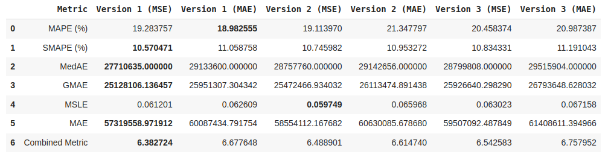

### Test case
I visualized the predictions for some test cases to explore the correlation between different features and the predicted price. I examined the impact of factors like the manufacturer, mileage, and fuel type. The results were consistent with expectations: 

- The price increases as the manufacturer year increases, meaning newer cars tend to be more expensive.
- As expected, the price decreases with higher mileage, which aligns with the general understanding that cars with more miles are worth less.
- Additionally, the model accurately reflected the pattern where petrol cars tend to be the cheapest, followed by oil cars, with hybrids and electric cars being more expensive.

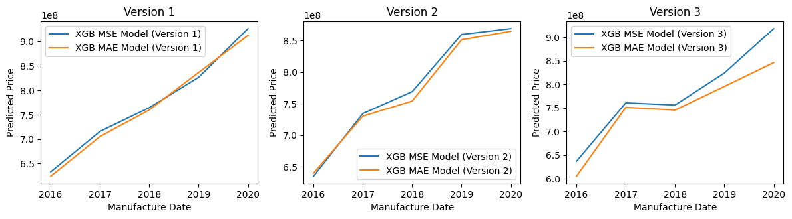 
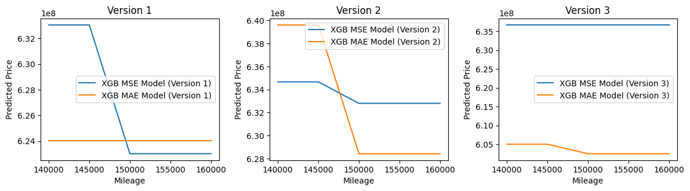 
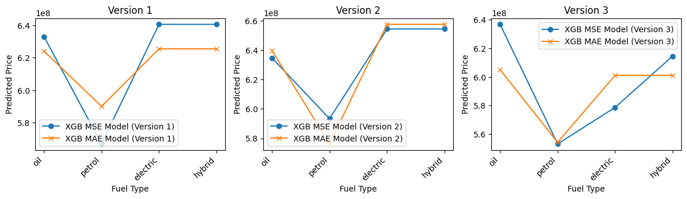

The **Combined Metric** indicates that **Version 1 with MSE as the loss function** performs the best. The test case results support this conclusion, further reinforcing the reliability of this metric in evaluating the model’s performance.

## 4. RESTful API

### API Development
- I developed a **RESTful API** using **FastAPI**, which accepts a POST request with car information (in JSON format) and returns a predicted car price.
- The API was tested for correct functionality, ensuring that it can process requests and return predictions accurately.

#### To Run the API:
```bash
uvicorn main:app --reload
```

#### Test request
```bash
curl -X 'POST' \
  'http://127.0.0.1:8000/predict?version=2&loss=mse&method=xgb' \
  -H 'accept: application/json' \
  -H 'Content-Type: application/json' \
  -d '{
        "manufacture_date": 2021,
        "brand": "Toyota",
        "model": "Camry",
        "origin": "Việt Nam",
        "type": "Sedan",
        "seats": 5.0,
        "gearbox": "AT",
        "fuel": "petrol",
        "color": "black",
        "mileage_v2": 100000,
        "condition": "used"
    }'

```

## 5. Next Steps and Model Improvement

### Improvement Opportunities
- The model could be improved by further tuning hyperparameters or experimenting with different algorithms (e.g., Random Forest, Gradient Boosting).
- I could also explore additional features (e.g., condition, year of manufacture) and refine the handling of missing values and outliers.

## 6. Summary

I have successfully completed all assignments, including data preprocessing, model development, and API creation. The model predicts car prices effectively, with clear insights gained from the data analysis and performance evaluation. Next steps include exploring model improvements and adding further features to enhance prediction accuracy.
